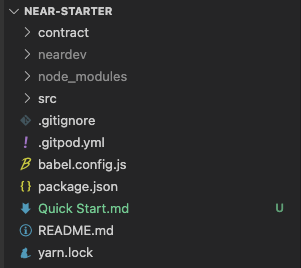
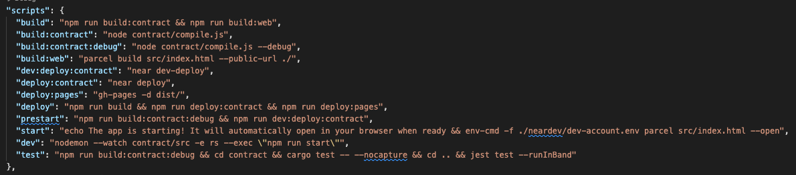
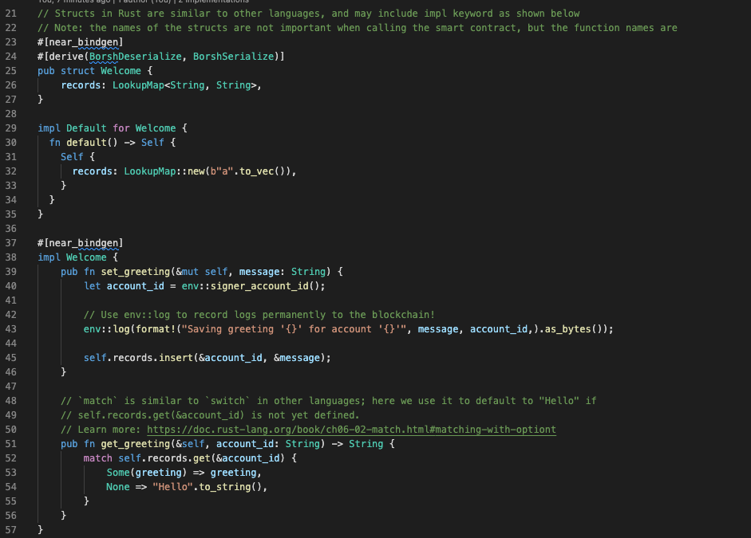
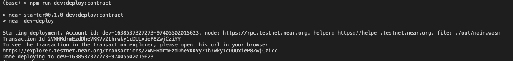
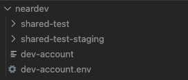
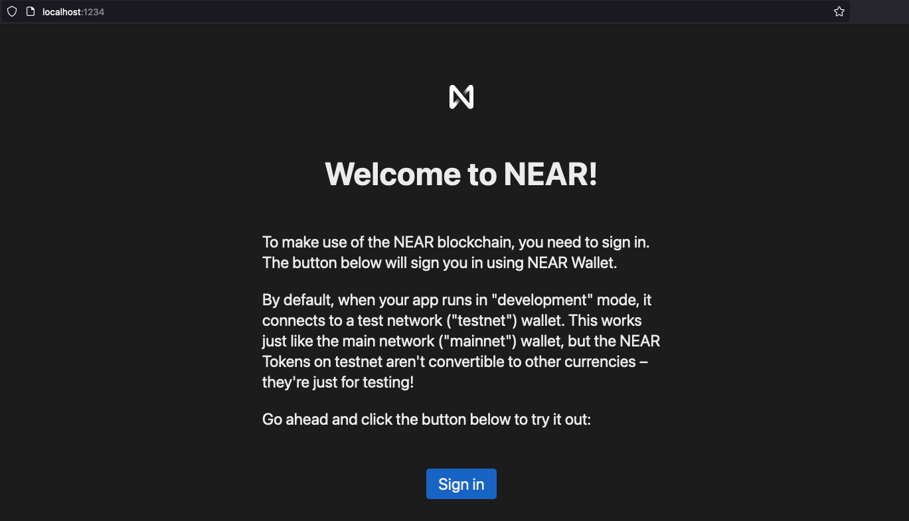
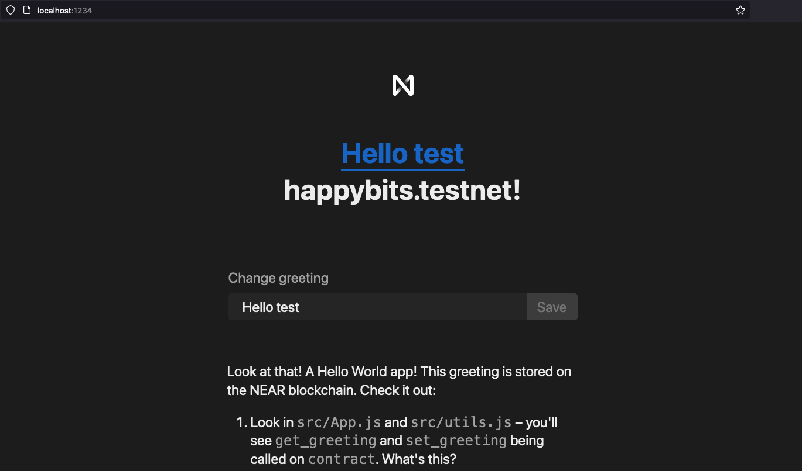

NEAR APP Quick Start
===========
- Install prerequisites
   - Node
   - Rust
   - npm install near-cli -g
- Fastest way to create an skaffold for near project is using `create-near-app`
   - you can run below command to create an project with React frontend and Rust contract
      - `npx create-near-app --frontend=react --contract=rust <your_app>`
      - you will see below project folder struct generated by the create-near-app
      
         

   - `contract` will be the rust near contract source
   - `src` will be the react frontend
   - `package.json` will have useful commands
   
      

- Let's see what is the generate rust contract

   
   
   - It defined an simple greeting contract with struct `Welcome`
      - it demo an `update` and `view` methods of an near contract
   - We can modify to our own later
- Let's build and deploy to dev account and interact with it
   - run
      - `npm run build:contract`
      - `npm run dev:deploy:contract`
         - It will create an dev near account on testnet and deploy the contract to it
         
            

         - You can found the account in `neardev` folder also
         
            

   - interact with the contract using near-cli
      - set the dev account in `neardev/dev-account` to env variable 
         - `source neardev/dev-account.env`
      - Call view method of the contract using `near view`
         - `near view $CONTRACT_NAME get_greeting '{"account_id": "$CONTRACT_NAME"}' --accountId $CONTRACT_NAME`
      - Call update method of the contract using `near call`
         - `near call $CONTRACT_NAME set_greeting '{"message": "aloha!"}' --accountId $CONTRACT_NAME`
- Let's Start our frontend in development mode
   - `npm run dev`
      - It will automatically open your browser
      
                  
         - if you don't have testnet account
            - you can create one in https://wallet.testnet.near.org/
      - After login
         - It will have `Change greeting` which will call our contract

            
- Happy Hacking!
